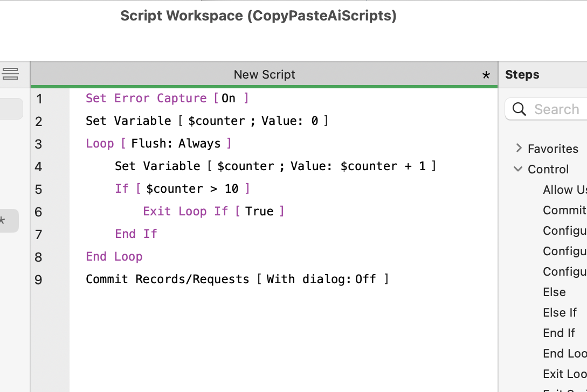

# Rialto

### The bridge between AI and FileMaker.

Rialto is a native macOS application that converts **AI-generated plain-text FileMaker scripts into FileMaker script XML that can be pasted directly into the FileMaker Pro Script Workspace.**

AI assistants such as ChatGPT, Claude and Gemini are very good at understanding what a FileMaker script should do and describing the required steps.

The problem is that they don't always produce FileMaker's native script format reliably.

**Rialto is the missing bridge.**

---

## How it works

The workflow is deliberately simple:

```text
┌─────────────────────┐
│         AI          │
│                     │
│  "Create a script   │
│   that..."          │
└──────────┬──────────┘
           │
           │ Plain-text script
           ▼
┌─────────────────────┐
│       RIALTO        │
│                     │
│     Translate       │
└──────────┬──────────┘
           │
           │ FileMaker XML
           ▼
┌─────────────────────┐
│     FileMaker Pro   │
│                     │
│   Script Workspace  │
└─────────────────────┘
```

**AI → Plain Text → Rialto → FileMaker**

That's it.

---

## Why Rialto?

Large Language Models are excellent at generating structured plain text, but FileMaker's native script representation is much more difficult for them to produce consistently.

For example, an AI can naturally produce:

```text
Set Error Capture [ On ]
Set Variable [ $counter ; Value: 0 ]
Loop
    Set Variable [ $counter ; Value: $counter + 1 ]
    If [ $counter > 10 ]
        Exit Loop If [ True ]
    End If
End Loop
Commit Records/Requests [ No dialog ]
```

Rialto translates this into **FileMaker script XML**:

```xml
<?xml version="1.0" encoding="UTF-8"?>
<fmxmlsnippet type="FMObjectList"><Step enable="True" id="86" name="Set Error Capture"><Set state="True"/></Step>
<Step enable="True" id="141" name="Set Variable"><Value><Calculation><![CDATA[0]]></Calculation></Value><Repetition><Calculation><![CDATA[1]]></Calculation></Repetition><Name>$counter</Name></Step>
<Step enable="True" id="71" name="Loop"><Restore state="False"/><FlushType value="Always"/></Step>
<Step enable="True" id="141" name="Set Variable"><Value><Calculation><![CDATA[$counter + 1]]></Calculation></Value><Repetition><Calculation><![CDATA[1]]></Calculation></Repetition><Name>$counter</Name></Step>
<Step enable="True" id="68" name="If"><Restore state="False"/><Calculation><![CDATA[$counter > 10]]></Calculation></Step>
<Step enable="True" id="72" name="Exit Loop If"><Calculation><![CDATA[True]]></Calculation></Step>
<Step enable="True" id="70" name="End If"/>
<Step enable="True" id="73" name="End Loop"/>
<Step enable="True" id="75" name="Commit Records/Requests"><NoInteract state="True"/></Step>
</fmxmlsnippet>
```

The resulting XML can then be **copied and pasted directly into the FileMaker Pro Script Workspace.**



No manual conversion is required.

---

## The idea

Rialto doesn't try to replace the AI.

It doesn't try to be an AI assistant.

It doesn't require an AI API.

Instead, it lets the AI do what it is good at:

> **Describe the script.**

And lets Rialto do what it is good at:

> **Turn that description into FileMaker script XML.**

This separation makes the workflow simple and flexible.

You can use Rialto with whichever AI you prefer:

* ChatGPT
* Claude
* Gemini
* Other LLMs
* Local AI models

Rialto doesn't care where the plain text came from.

---

## A typical workflow

### 1. Ask your AI

For example:

> Create a FileMaker script that finds all unpaid invoices, loops through them and sends each customer an email.

### 2. Copy the AI's response

The AI produces a structured plain-text representation of the script.

### 3. Paste it into Rialto

Rialto analyses the script steps and parameters.

### 4. Translate

Rialto generates the corresponding FileMaker script XML.

### 5. Copy

Copy the result to the clipboard.

### 6. Paste into FileMaker

Paste it directly into the **FileMaker Pro Script Workspace**.

---

## What Rialto is not

Rialto is deliberately focused.

It is not:

* An AI chatbot
* An alternative to ChatGPT or Claude
* A FileMaker replacement
* A cloud service
* An AI API
* A FileMaker plugin

It is a **bridge between AI-generated plain text and FileMaker scripting.**

---

## Features

* Native macOS application
* Built with Swift and SwiftUI
* Converts structured plain text into FileMaker script XML
* Supports a large range of FileMaker script steps
* Handles script parameters and nested structures
* Produces FileMaker-compatible script XML
* Runs locally on your Mac
* No AI API key required
* Works with any AI capable of producing the required plain-text format
* Output can be copied directly into the FileMaker Script Workspace

---

## Built with Swift

Rialto is a native macOS application built using:

* **Swift**
* **SwiftUI**
* Native macOS frameworks

The project separates the user interface from the translation engine, making the core translation functionality independent of the application interface.

```text
Rialto/
├── Models/
├── Services/
├── TranslationEngine/
├── ViewModels/
├── Views/
└── Assets.xcassets/
```

---

## Requirements

* macOS
* FileMaker Pro
* Xcode (for building from source)

Supported macOS and FileMaker versions will be documented as the project develops.

---

## Installation

Download the [latest release](https://github.com/arbyteconsulting/rialto/releases/latest) from the GitHub Releases page.

Alternatively, clone the repository and build Rialto using Xcode.

```bash
git clone https://github.com/arbyteconsulting/rialto.git
```

Open:

```text
Rialto.xcodeproj
```

in Xcode and build the application.

### First launch

Rialto is not currently notarized by Apple (this requires a paid Apple Developer Program membership). As a result, macOS Gatekeeper may warn that the app is "from an unidentified developer" or "cannot be verified" the first time you open it.

To run it anyway:

1. Locate **Rialto.app** in Finder (don't double-click it yet).
2. Right-click (or Control-click) the app and choose **Open**.
3. In the dialog that appears, click **Open** to confirm.

You only need to do this once — after the first launch, macOS will open the app normally.

If you still see a warning, you can also remove the quarantine flag manually in Terminal:

```bash
xattr -cr /Applications/Rialto.app
```

## Screenshots

*Screenshots and an animated demonstration will be added here.*

The ideal workflow is simple enough to demonstrate in a few seconds:

```text
AI
 ↓
Copy
 ↓
Rialto
 ↓
Translate
 ↓
Copy
 ↓
FileMaker Script Workspace
 ↓
Paste
```

---

## Project Status

Rialto is an open-source project under active development.

The core translation engine is functional and supports a substantial range of FileMaker script steps.

There will inevitably be FileMaker script steps, parameters and edge cases that need further refinement.

If you find something that doesn't translate correctly, please report it.

---

## Contributing

Contributions, bug reports and suggestions are welcome.

If you encounter a translation problem, please include:

* The plain-text input
* The generated output
* The expected FileMaker script
* Your FileMaker version, where relevant

This makes it much easier to reproduce and fix translation issues.

---

## Known Limitations

Rialto's translation engine is under active development. A few specific gaps worth knowing about:

- **Steps with two calculation fields may only recover one.** `Set Selection`, for example, takes both a Start Position and an End Position calculation — the current XML parser tracks a single active `<Calculation>` block per step, so dual-calculation steps like this can lose one side on translation. Fixing this needs the parser to support multiple concurrent calculation contexts per step.

- **Trigger Claris Connect Flow is intentionally unsupported.** Its real FileMaker XML embeds data — auth tokens, curl flags — that can't be reconstructed from an AI-generated plain-text description. This isn't a bug to be fixed so much as a boundary of what plain-text-to-XML translation can safely do.

- **Steps with multiple or nested sub-parameters are the highest-risk area for silent mis-translation.** Field- and script-reference resolution has been fixed for steps like `Set Field`, `Go to Field`, `Install OnTimer Script`, and the NFC/notification/region-monitor family, but the step library is large. If a step has a Set Selection-like shape (more than one calculation or sub-clause), treat its output with extra scrutiny until it's been explicitly verified.
If you hit a translation issue, especially in these areas, please report it — see Contributing above.
---

## Why "Rialto"?

The name has a couple of connections.

**Rialto is a village in Dublin, Ireland**, close to where the author lives. It got its name from a newly built bridge (in 1795). Like many civic constructions in Dublin it was given a nickname and locals felt the new bridge looked like the Rialto Bridge in Venice - the name stuck and grew to encompass the area around the bridge.

The name seemed fitting for an application whose purpose is to provide a bridge between two worlds:

**AI ↔ FileMaker**

AI generates the plain-text representation of a FileMaker script. Rialto translates it into FileMaker script XML that can be pasted directly into the FileMaker Pro Script Workspace.

**AI writes the script. Rialto makes it FileMaker.**

---

## Trademark Notice

FileMaker and Claris are trademarks of Claris International Inc.

Rialto is an independent, third-party project and is not affiliated with, sponsored by, or endorsed by Claris International Inc.

---

## Licence

MIT License

Copyright (c) 2026 Arbyte Consulting

Permission is hereby granted, free of charge, to any person obtaining a copy
of this software and associated documentation files (the "Software"), to deal
in the Software without restriction, including without limitation the rights
to use, copy, modify, merge, publish, distribute, sublicense, and/or sell
copies of the Software, and to permit persons to whom the Software is
furnished to do so, subject to the following conditions:

The above copyright notice and this permission notice shall be included in all
copies or substantial portions of the Software.

THE SOFTWARE IS PROVIDED "AS IS", WITHOUT WARRANTY OF ANY KIND, EXPRESS OR
IMPLIED, INCLUDING BUT NOT LIMITED TO THE WARRANTIES OF MERCHANTABILITY,
FITNESS FOR A PARTICULAR PURPOSE AND NONINFRINGEMENT. IN NO EVENT SHALL THE
AUTHORS OR COPYRIGHT HOLDERS BE LIABLE FOR ANY CLAIM, DAMAGES OR OTHER
LIABILITY, WHETHER IN AN ACTION OF CONTRACT, TORT OR OTHERWISE, ARISING FROM,
OUT OF OR IN CONNECTION WITH THE SOFTWARE OR THE USE OR OTHER DEALINGS IN THE
SOFTWARE.


See [LICENSE](LICENSE) for details.

---

## Author

**Richard Whyte**

Rialto was created as an exploration of how Large Language Models can be used more effectively in FileMaker development.

If you find Rialto useful, please ⭐ star the repository and share it with other FileMaker developers.

---

# Rialto

### AI writes the script. Rialto makes it FileMaker.

**AI → Plain Text → Rialto → FileMaker**
